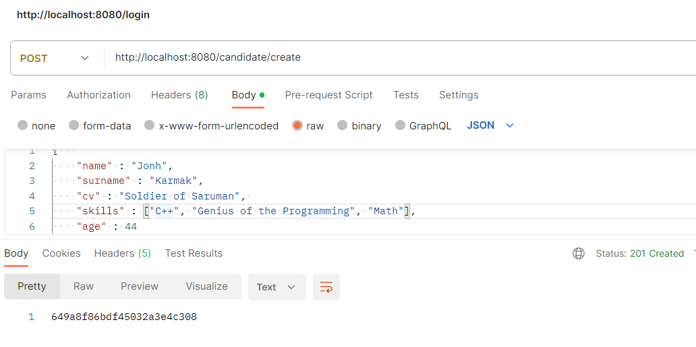
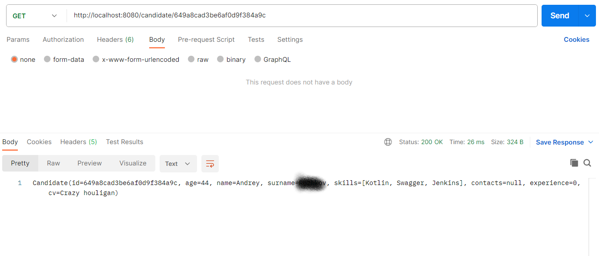
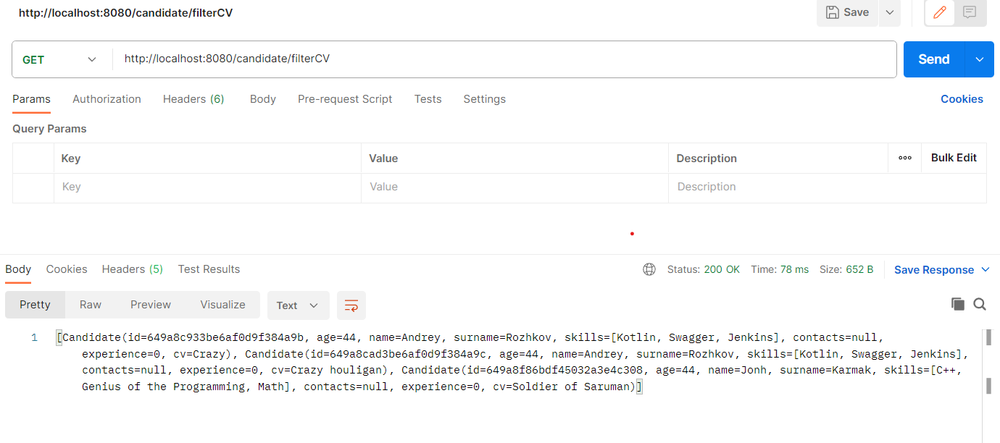
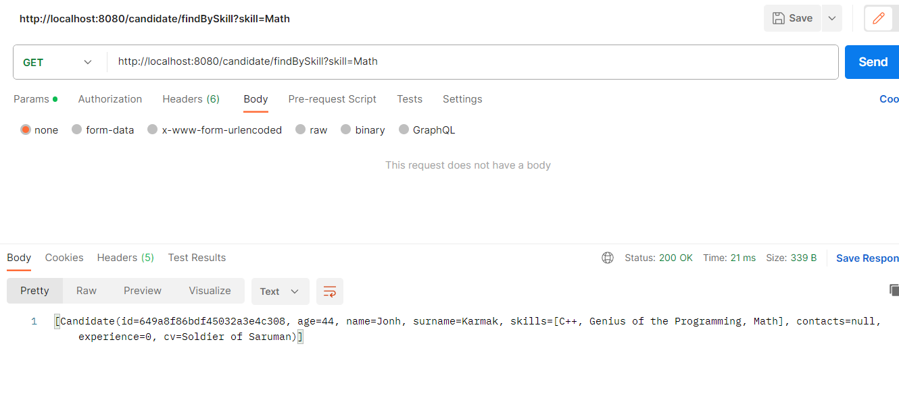

# Проект HR база

## Описание
Данный проект - возможность посмотреть на работу MongoDb вживую. Цель - создание базы кандидатов, где каждый из них может рассказать о себе то, что желает нужным.
HR специалист сможет найти кандидатов, используя фильтры.

## Что должно быть выполнено по готовности проекта
В данном проекте нужно реализовать сложные фильтры, чтобы HR смогла искать кандидатов по ряду параметров.

### Стек:
- **Java 17**
- **Spring Boot 2.7.10**
- **MongoDB**
- **Spring (Data, REST)**

### Запуск
Launch Main.class /src/main/java/ru.sevastopall.hrbase/HrbaseApplication

### Требования:
- **Java 17**
- **Maven 3.8**
- **MongoDB**

### Скриншоты:
Добавление

Поиск по ID

Поиск по наличию CV

Поиск по ключевому навыку

### Текущие задачи:
        Написание сложной фильтрующей системы
